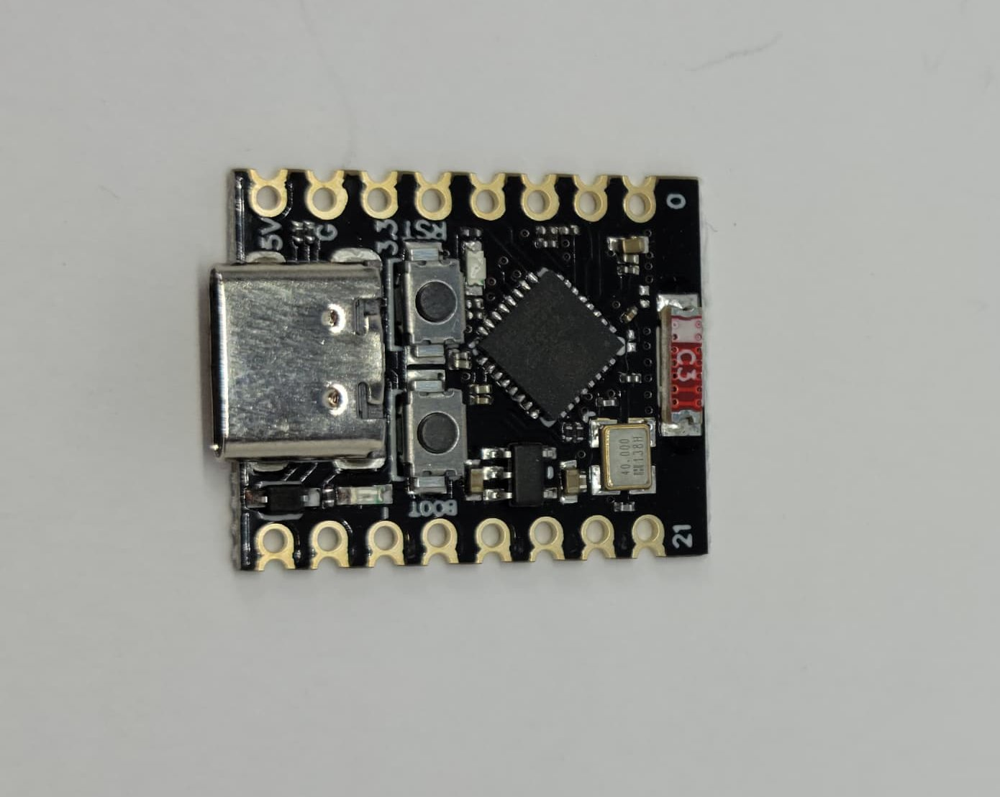

# Core Board Preparation

This guide covers the preparation and initial setup of the main control boards for the Chelonian Access system.

## Component Overview

*ESP32-C3 SuperMini Board*

*PN532 NFC/RFID Module*

*8-Pin Connector (Female Side)*

## Required Components

- ESP32-C3 SuperMini
- PN532 NFC/RFID Module
- Soldering iron and solder
- Small screwdriver set
- Jumper wires

## Preparation Steps

### 1. ESP32-C3 SuperMini Setup

1. **Initial Inspection:**
   - Carefully inspect the board for any damage
   - Verify all components are properly seated
   - Check for any manufacturing defects

2. **Header Installation:**
   - If headers aren't pre-soldered, install them now
   - Ensure headers are straight and properly aligned
   - Solder all pins completely
   - Clean any excess flux

### 2. PN532 Module Preparation

1. **Module Configuration:**
   -  *PN532 NFC/RFID Module Jumpers*
   - Set jumpers for SPI mode operation
   - Verify the module is set to 3.3V operation

2. **Initial Testing:**
   - Check all solder joints
   - Verify jumper positions

### 3. Simple Sexy PCB Setup

1. **Relay Connections:**
   - Solder individual wires to relay pins
   - **Brown** - Relay 1 control
   - **Orange** - Relay 2 control
   - **Yellow** - Relay 3 control
   - **Green** - Relay 4 control
   - Verify all connections are secure

2. **8-Pin Connector:**
   - Solder female connector to board
   - **Brown** - SPI MISO (PN532)
   - **Orange** - SPI MOSI (PN532)
   - **Green** - SPI SCK (PN532)
   - **Yellow** - SPI SS/CS (PN532)
   - Verify all connections are secure

### Best Practices

- Use proper soldering temperature
- Clean all surfaces before soldering
- Allow joints to cool naturally
- Test continuity after soldering

### Testing

1. Check all solder joints visually
2. Test continuity of connections
3. Verify correct jumper positions
4. Document any modifications
