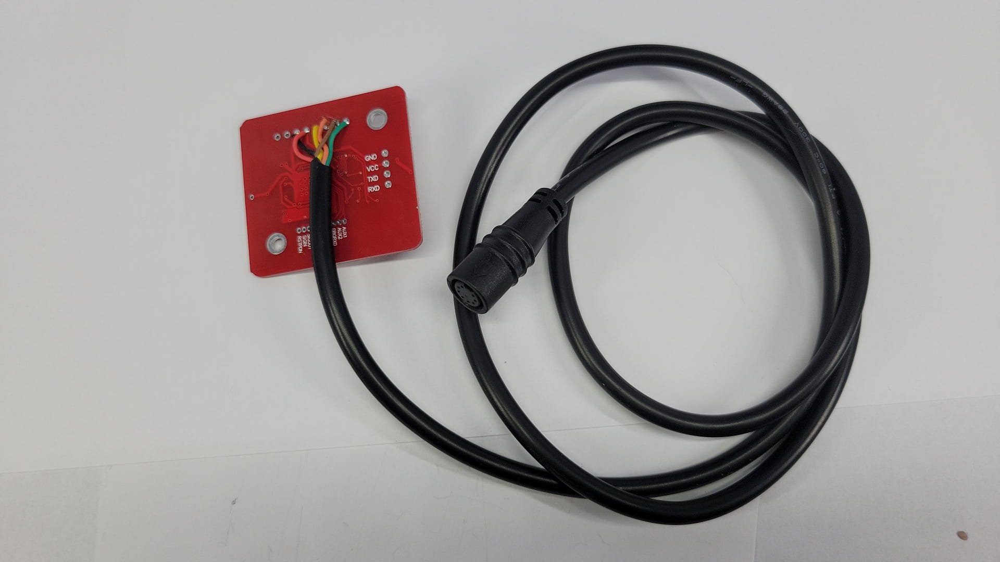
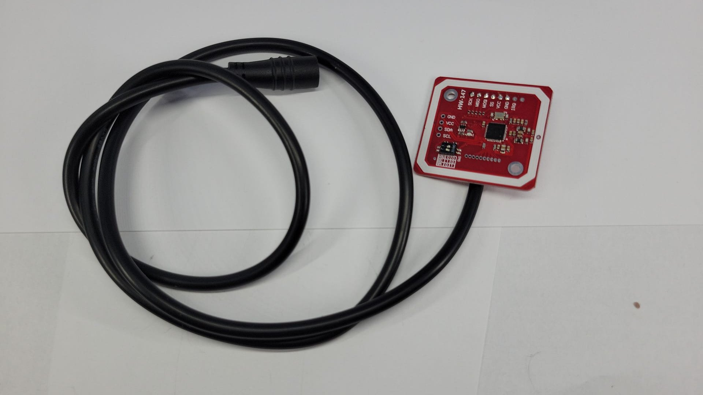

# RFID Reader Installation

This guide covers the installation and setup of the PN532 NFC/RFID module in the Chelonian Access system.

## Component Images

*PN532 Module Wiring*

*PN532 Module - Front View*

## Required Components

- PN532 NFC/RFID Module
- Shielded cable

## Installation Steps

### 1. Module Placement

1. **Location Selection:**
   - Choose location away from metal surfaces
   - Maintain 10cm distance from other electronics
   - Consider reader accessibility
   - Plan for cable routing

### 2. Wiring Installation

1. **SPI Connections:**
   - Keep SPI wires as short as possible
   - Use shielded cable if available
   - **Red** - SPI VCC (PN532)
   - **Black** - SPI GND (PN532)
   - **Brown** - SPI MISO (PN532)
   - **Orange** - SPI MOSI (PN532)
   - **Green** - SPI SCK (PN532)
   - **Yellow** - SPI SS/CS (PN532)

### Best Practices

- Keep antenna away from metal
- Use shielded cables for SPI
- Maintain proper spacing
- Test before final mounting

### Testing

1. Verify power connections
2. Test read range
3. Check for interference
4. Validate card detection

### Troubleshooting

- Check cable shielding
- Verify power supply
- Test in different positions
- Look for interference sources
