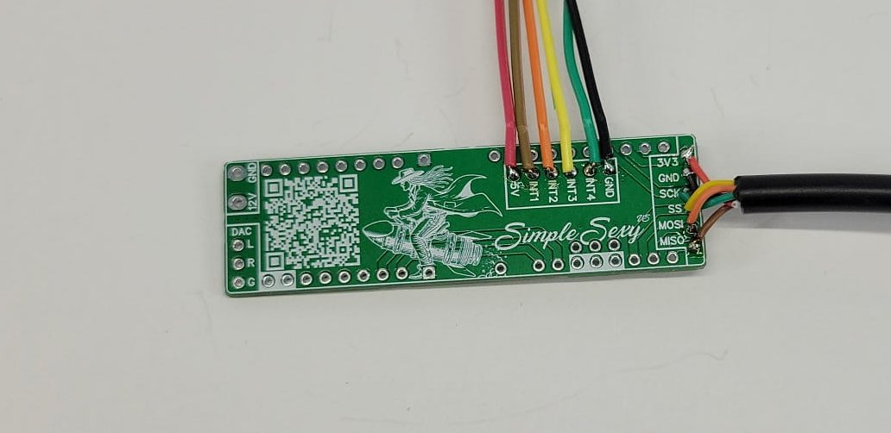
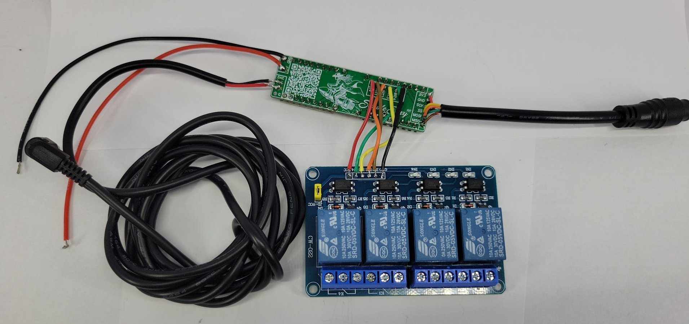

# Final Assembly

This guide covers the final assembly steps, enclosure preparation, and system testing for the Chelonian Access system.

## Assembly Progress

Here's what your assembly should look like at various stages:

*Initial component wiring*

*Completed wiring assembly*

*Final assembly - front view*

*Final assembly - back view*

## Required Components

- Project enclosure
- Mounting hardware
- Cable ties
- Labels
- Multimeter
- Tools for cutting/drilling

## Assembly Steps

### 1. Enclosure Preparation

1. **Plan Layout:**
   - Mark all component positions
   - Plan cable routing
   - Consider ventilation needs
   - Account for maintenance access

2. **Create Openings:**
   - Cut/drill holes for:
     - RFID antenna (minimize metal around it)
     - Status LEDs
     - Speaker grille
     - Cable entry points
     - Mounting points
   - Deburr all openings
   - Add grommets where needed

### 2. Component Installation

1. **Mount Components:**
   - Use standoffs for boards
   - Ensure good airflow
   - Separate high/low voltage
   - Maintain proper spacing

2. **Cable Management:**
   - Route cables properly
   - Add strain relief
   - Use cable ties
   - Label all connections

### 3. System Testing

1. **Power Testing:**
   - Check all power connections
   - Verify ground connections
   - Test voltage levels
   - Check for hot spots

2. **Functional Testing:**
   - Test RFID read range
   - Verify relay operation
   - Check audio feedback
   - Test all features

### Best Practices

- Use proper mounting hardware
- Add ventilation if needed
- Document modifications
- Take photos of assembly

### Final Checklist

1. All connections secure
2. Proper strain relief
3. All openings sealed
