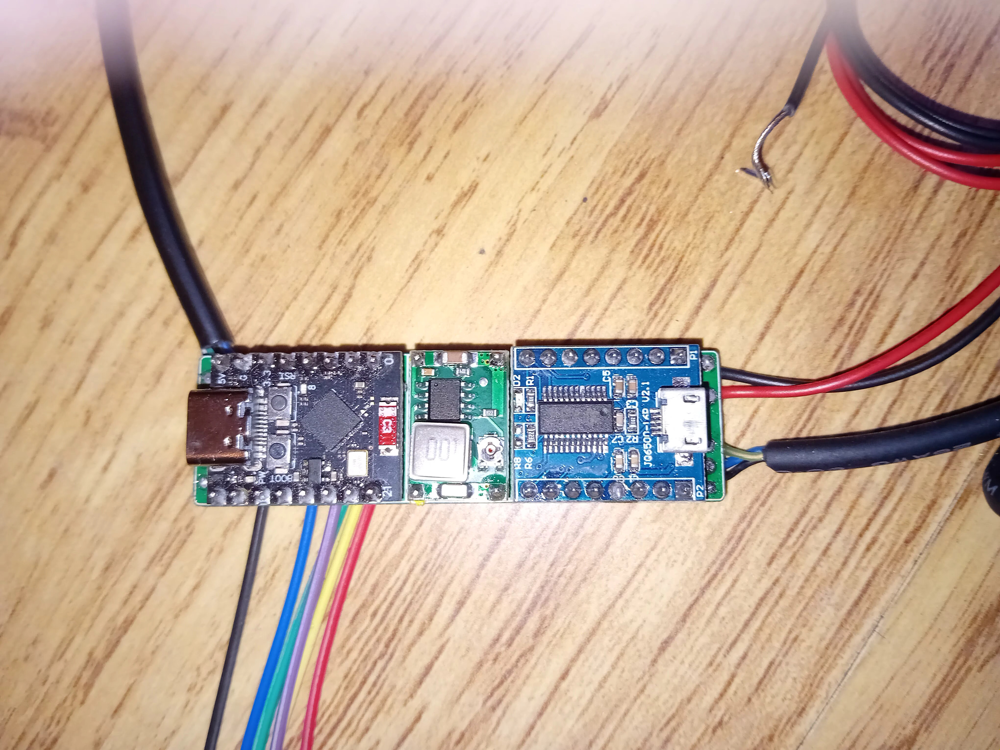
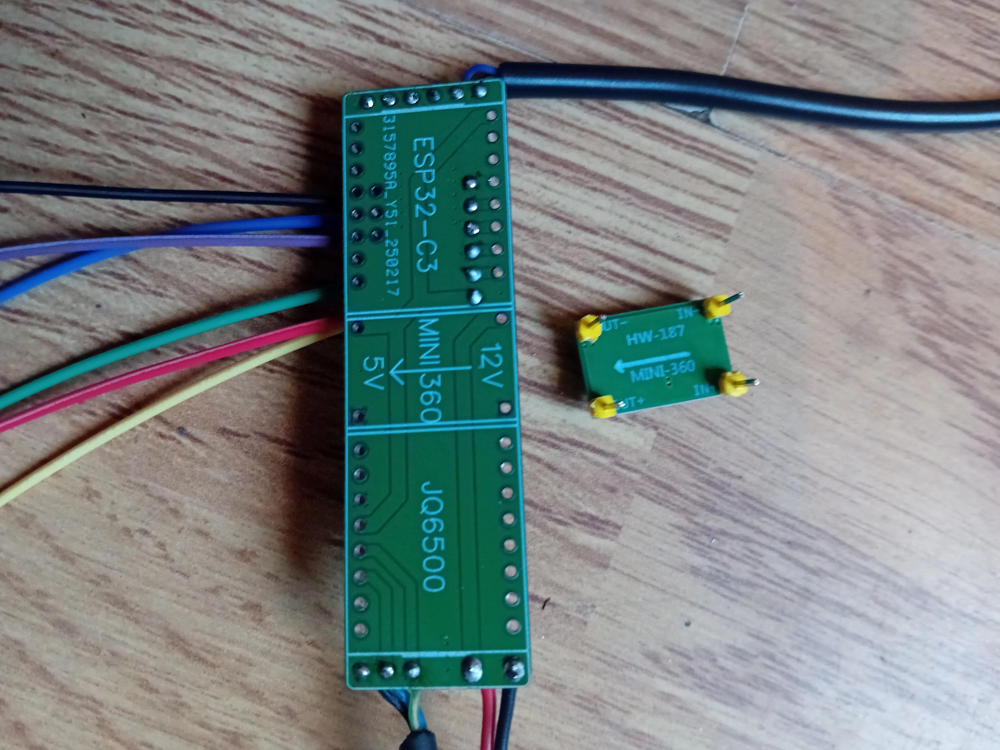

# Hardware Assembly Guide

This guide provides an overview of the Chelonian Access system hardware assembly process. The complete assembly is broken down into smaller, manageable steps, each with its own detailed guide. Follow these guides in order for the best results.

## System Overview

Here's what the completed assembly looks like:

*All components laid out before assembly*

*Completed main PCB front - front view*

*Completed main PCB back - back view*

## Assembly Overview

1. [Power Supply Setup](01_POWER_SUPPLY_SETUP.md) - Configure the power distribution system
2. [Core Board Preparation](02_CORE_BOARD_PREP.md) - Prepare and test the main control boards
3. [Main Connections](03_MAIN_CONNECTIONS.md) - Connect power and ground between components
4. [RFID Reader Installation](04_RFID_INSTALLATION.md) - Install and configure the RFID reader
5. [Relay Module Setup](05_RELAY_SETUP.md) - Set up the relay control system
6. [Final Assembly](06_FINAL_ASSEMBLY.md) - Complete the system assembly and testing

Follow each guide in sequence for the best results. Each subguide contains detailed instructions, testing procedures, and troubleshooting tips.

## Prerequisites

### Required Components

- ESP32-C3 SuperMini
- PN532 NFC/RFID Module
- 4-Channel Relay Module (SRD-05VDC-SL-C)
- JQ6500 MP3 Player Module
- Mini360 Buck Converter
- Speaker (8Ω, compatible with JQ6500)
- Jumper wires
- 12V power source
- Project enclosure
- Common ground wire
- Strain relief for cables

### Required Tools

- Soldering iron and solder
- Wire strippers
- Small screwdriver set
- Multimeter for testing
- Heat shrink tubing
- Zip ties for cable management

## Getting Started

Follow the assembly guides in order, starting with the power supply setup. Each guide contains:

- Required components for that section
- Step-by-step instructions
- Testing procedures
- Troubleshooting tips

If you encounter any issues during assembly, refer to the troubleshooting section in the relevant guide.

## Important Guidelines

Throughout the assembly process, keep these key points in mind:

1. **Safety First**
   - Always disconnect power before making changes
   - Use proper tools and safety equipment
   - Follow proper electrical safety practices
   - Document all modifications

2. **Quality Matters**
   - Use appropriate wire gauges
   - Make secure connections
   - Label everything clearly
   - Test as you go

3. **Take Your Time**
   - Follow each guide carefully
   - Double-check all connections
   - Document your progress
   - If unsure, ask for help

## Next Steps

After completing all assembly steps:

1. Proceed to the software installation guide
2. Configure and test each feature
3. Set up access control settings
4. Establish a maintenance schedule

For detailed testing procedures and maintenance guidelines, refer to our operations manual.
